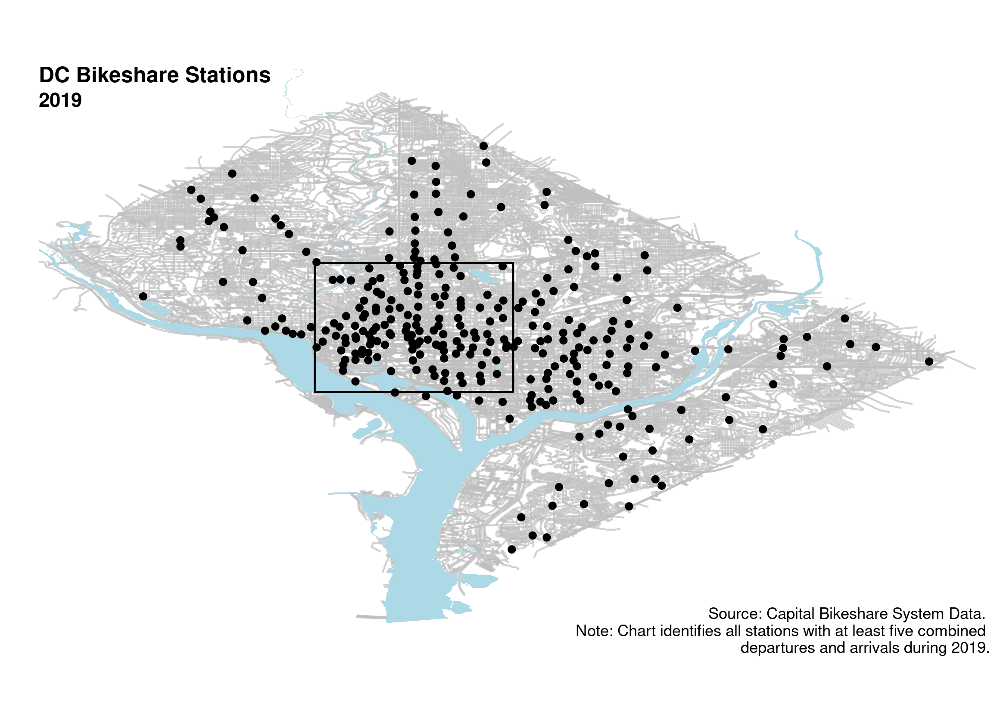
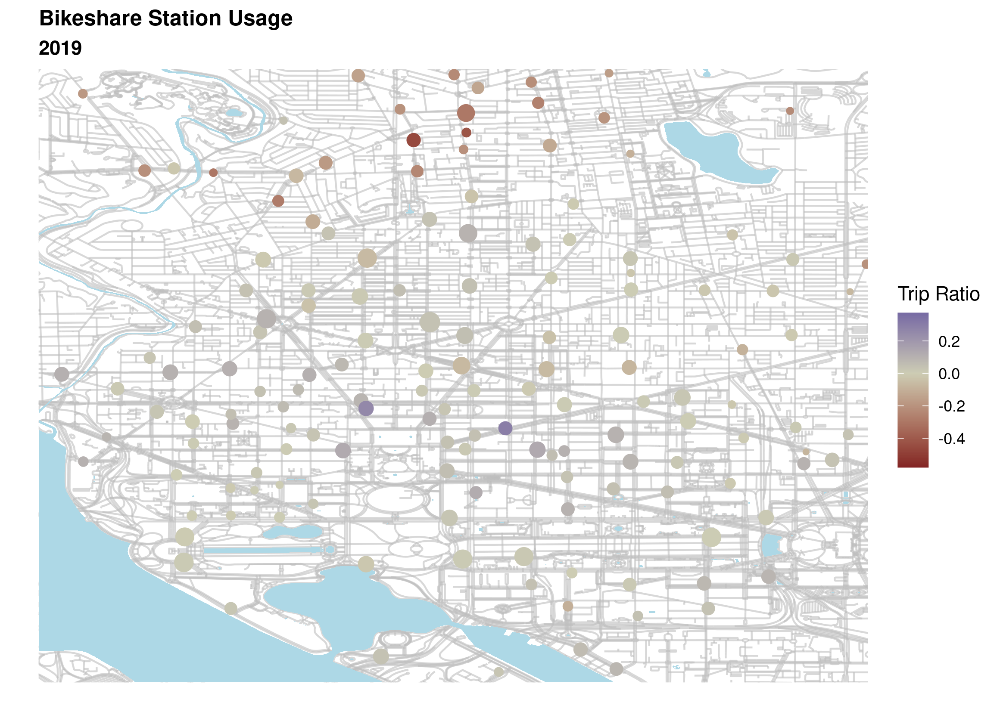

  
```{r include = FALSE}
dir <- dirname(dirname(rstudioapi::getSourceEditorContext()$path))
setwd(dir)

pacman::p_load(data.table, stargazer, ggplot2, lubridate, stats)

# (startNAME, endNAME, year, month)
dt <- readRDS("derived/Capital Bikeshare Flows (2015-2019).Rds")

# (startNAME, year, month)
dt.stations <- dt[startNAME == endNAME, .(startNAME, ID, date, startNTrips, endNTrips)]
dt.stations[, netTrips := endNTrips - startNTrips][, grossTrips := endNTrips + startNTrips]
dt.stations[, `Trip Ratio` := netTrips / grossTrips]
dt.stations[, openYear := min(year(date)), by = .(startNAME)][, nStations := 1]
dt.stations <- dt.stations[grossTrips >= 5]

# (startNAME, endNAME, year)
dt.segment <- dt[startNAME != endNAME, .(nTrips = sum(nTrips)), by = .(startNAME, endNAME, year, distance, dist_cal, dElevation)]

# (month)
dt.months <- dt.stations[, .(nStations = sum(nStations), nTrips = sum(startNTrips)), by = .(date)]

# (year)
dt.years <- dt.stations[, .(nTrips = sum(startNTrips)), by = .(year = year(date), startNAME)]
dt.years[, nStations := 1]
dt.years <- dt.years[, .(nTrips = sum(nTrips), nStations = sum(nStations)), by  = .(year)]

```
  
In 2008, Washington, DC launched the first bikesharing system in the US. It has since expanded to include stations in Maryland and Virginia, but this analysis is limited to trips occurring within DC.

The introduction of powered and dockless scooters and bikes poses a substantial threat to the financial viability of Capital Bikeshare. As users substitute to e-scooters and electric bikes for uphill trips, the cost of maintaining 


After years of a steady increase, average daily trips on the network peaked in 2017. Competition from e-scooters and dockless bikes, first introduced at the start of 2018, is likely responsible for the slight decline.

```{r echo = FALSE}
ggplot(data = dt.months, mapping = aes(x = date, y = nTrips / days_in_month(date))) +
  geom_line(linetype = "dashed", color = "gray") +
  geom_point(color = "black", size = 3) +
  labs(title = "Average Daily Trips on Capital Bikeshare by Month", # (by month)
       subtitle = "2015-2019",
       x = "Year", y = "Average Daily Trips") +
  scale_y_continuous(limits =  c(0, 12000)) +
  scale_x_date(date_breaks = "1 year") +
  theme_light()
```

Despite the sticky heat of Washington in the summertime, usage of the system increases roughly 3-fold between January and May each year.

Capital Bikeshare has continued to expand the network. The number of active[^1] stations in DC proper grew by `r dt.years[year == 2019, nStations] - dt.years[year == 2015, nStations]` between 2015 and 2019. However, these stations have appeared in increasingly marginal locations, and the number of trips per station has fallen steadily.

```{r echo = FALSE}
ggplot(data = dt.years[, avgStation := nTrips / (nStations * 365)], mapping = aes(x = year, y = avgStation)) +
  geom_line(linetype = "dashed", color = "gray") +
  geom_point(color = "black", size = 3) +
  labs(title = "Average Daily Trips per Station",
       subtitle = "2015-2019",
       x = "Year", y = "Trips") +
  scale_y_continuous(limits = c(25, 37.5), breaks = c(25, 27.5, 30, 32.5, 35, 37.5)) +
  theme_light()
```

The average trip in 2019 was roughly `r round(weighted.mean(dt.segment[year == 2019, .(distance)], dt.segment[year == 2019, .(nTrips)])/.6213712, 2)` miles long. It arrived at a station which was `r round(weighted.mean(dt.segment[year == 2019, .(dElevation)], dt.segment[year == 2019, .(nTrips)])*3.28084, 2)` feet lower in elevation than the point of departure, and a typical cyclist would have expended about `r round(weighted.mean(dt.segment[year == 2019, .(dist_cal)], dt.segment[year == 2019, .(nTrips)]))` Calories of energy along the way.

## The Geography of Bikesharing

```{r echo=FALSE}

```

Bikes tend to migrate towards the National Mall. Accordingly, the system suffers from chronic imbalances, and it is only by employing fleets of vans that the system operator can ensure bikes are consistently available at every station. 

```{r echo=FALSE}

```

[^1]: A station is "active" if it has at least five combined arrivals and departures over the calendar year.

